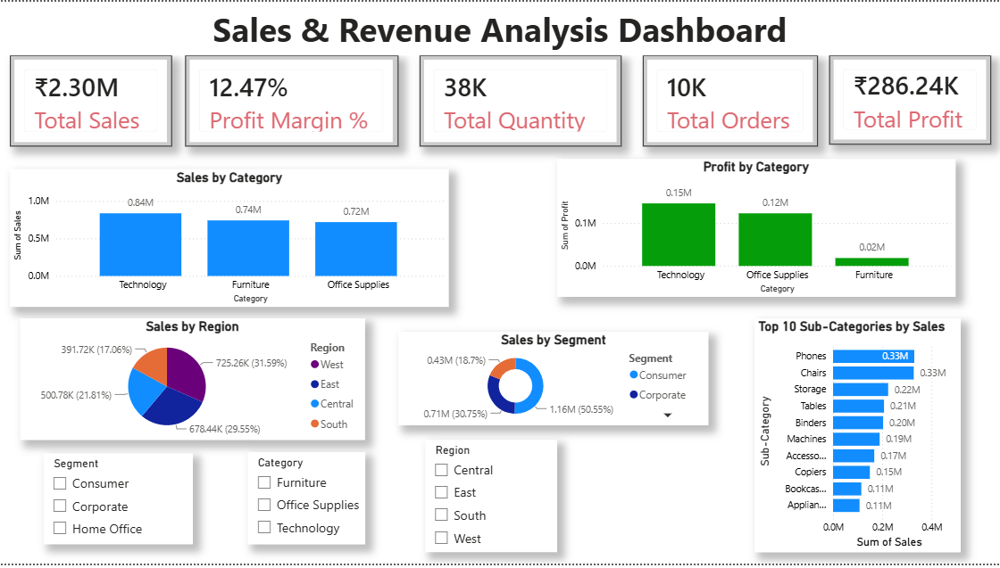

# 📊 Sales & Revenue Analysis Dashboard

## 📌 Project Overview

This project is an interactive Power BI dashboard built using the Sample Superstore dataset. It analyzes sales, profit, customer segments, and regional performance to provide business insights.

---

## 🛠️ Tools Used

- Power BI Desktop
- Microsoft Excel
- Power Query
- DAX

---

## 📈 KPIs

- Total Sales
- Total Profit
- Total Orders
- Total Quantity
- Profit Margin %

---

## 📊 Dashboard Features

- Sales by Category
- Profit by Category
- Sales by Region
- Sales by Segment
- Top 10 Sub-Categories by Sales
- Interactive Filters (Region, Category, Segment)

---

## 💡 Business Insights

- Technology generated the highest sales.
- Technology generated the highest profit.
- Phones are the best-selling sub-category.
- West region contributes the highest sales.
- Consumer segment contributes the largest share of sales.

---

## 📷 Dashboard Preview

---

## 📂 Dataset

Sample Superstore Dataset

---

## 👩‍💻 Author

Shravani Sandip Chavan